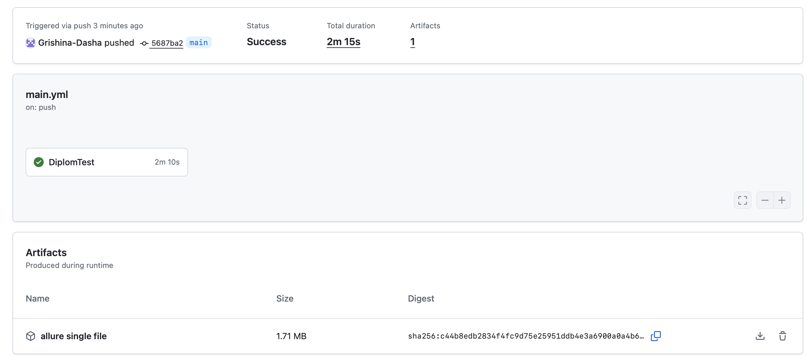
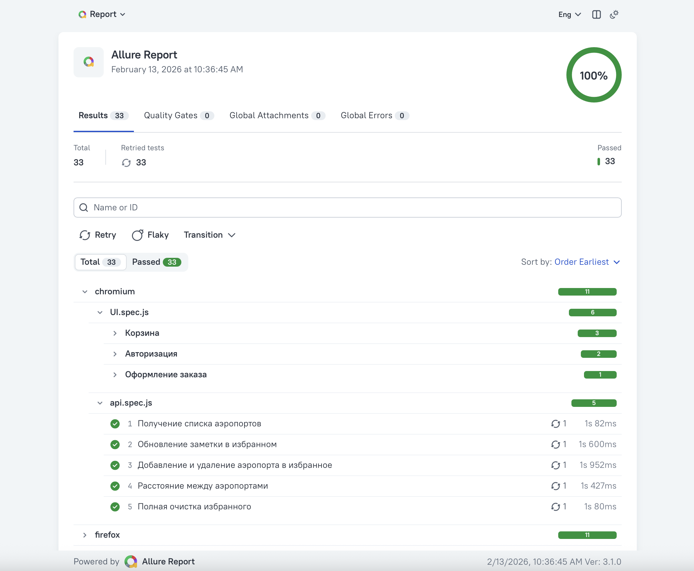
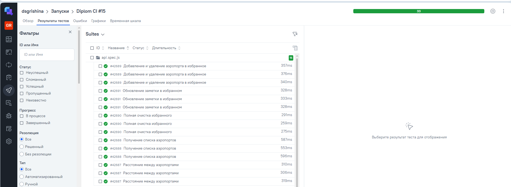
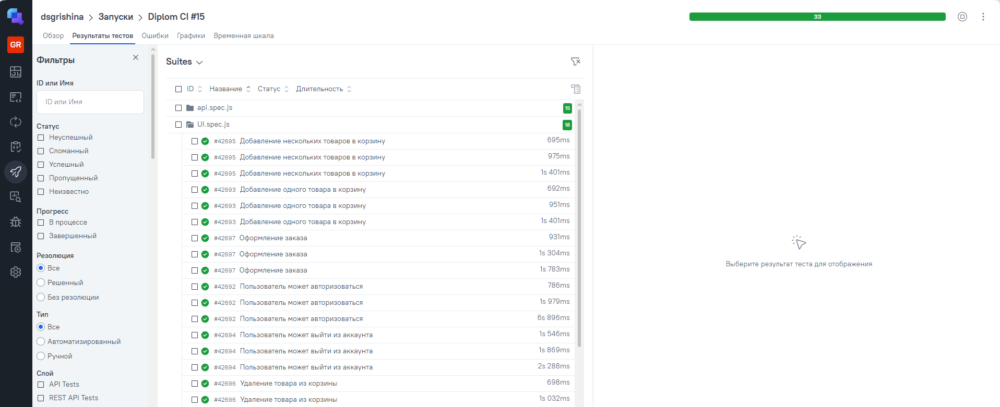
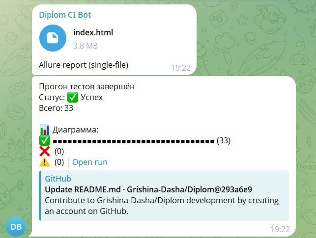

# 🧪 Дипломный проект: комплексное тестирование (Web, API)

## 📌 Описание проекта
Этот репозиторий содержит автоматические тесты для:

- **UI**: [Saucedemo](https://www.saucedemo.com) — демо-магазин для тестирования интерфейса, логики покупок и корзины.  
- **API**: [Airportgap API](https://airportgap.com/api) — сервис для проверки API-запросов и структуры данных.  

Цель проекта — обеспечить **надежную автоматизацию тестирования** как для пользовательского интерфейса, так и для API, с возможностью интеграции с CI/CD и визуализации отчетов.  

Проект интегрирован с:  
- **GitHub Actions** — автоматический запуск тестов при push и pull request  
- **Allure Report** — наглядная визуализация результатов тестов  
- **Allure TestOps** — хранение истории прогонов
- **Telegram** — автоматические уведомления о статусе тестов  

---

## 🛠 Технологический стек

 
- **Язык:** JavaScript  
- **Фреймворк для тестов:** Playwright  
- **CI/CD:** GitHub Actions  
- **Отчеты:** Allure Report + Allure TestOps  
- **Уведомления:** Telegram  

---

## 🖥 Тестируемое приложение

### 1️⃣ UI (Saucedemo)
Основные сценарии:
- Логин / Logout
- Добавление одного/нескольких товаров в корзину
- Удаление товара из корзины
- Проверка оформления заказа

### 2️⃣ API (Airportgap)
Основные сценарии:
- GET-запрос для получения списка аэропортов
- POST-запрос для вычисления дистанции между аэропортами
- POST-запрос на добавление аэропорта в избранное
- POST-запрос на удаление аэропорта из избранного
- POST-запрос на удаление всех элементов в избранном
- PATCH-запрос на редактирование данных для аэропорта в избранном

---

## 🔄 CI/CD и отчеты

- Все тесты запускаются автоматически при push через GitHub Actions.
- Результаты сохраняются как артефакты GitHub.
  
- Отчёты визуализируются с помощью Allure Report.  
  
- История прогонов передается в Allure TestOps для удобного анализа.  
    
  
  
---

## 📩 Уведомления в Telegram

- После каждого прогона тестов бот отправляет:
  - Текстовую сводку с количеством успешных, упавших и пропущенных тестов
  - Файл Allure отчёта в формате single-file  
    
- Для работы необходимо настроить:
  - `TELEGRAM_BOT_TOKEN` и `TELEGRAM_CHAT_ID` в secrets репозитория
